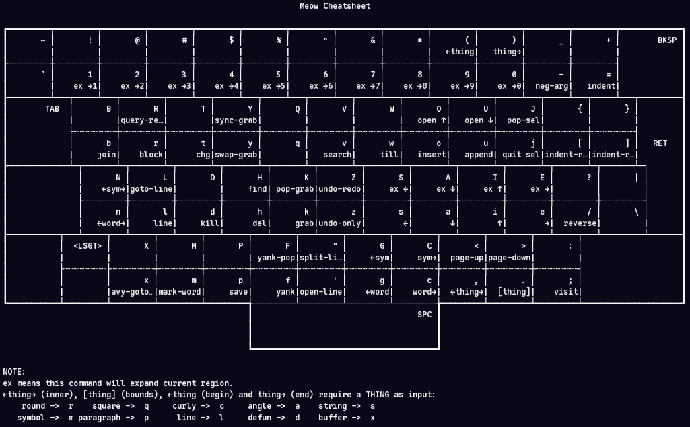
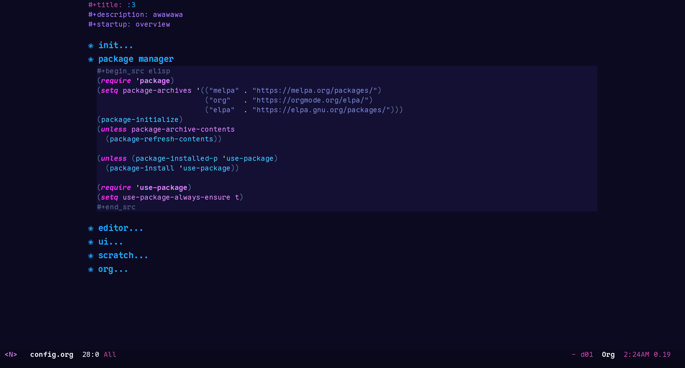
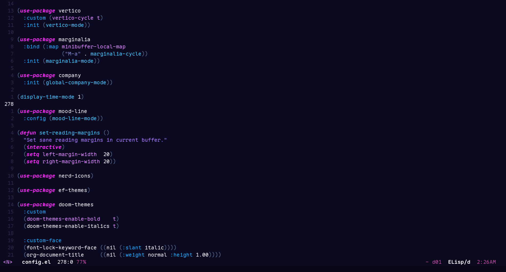
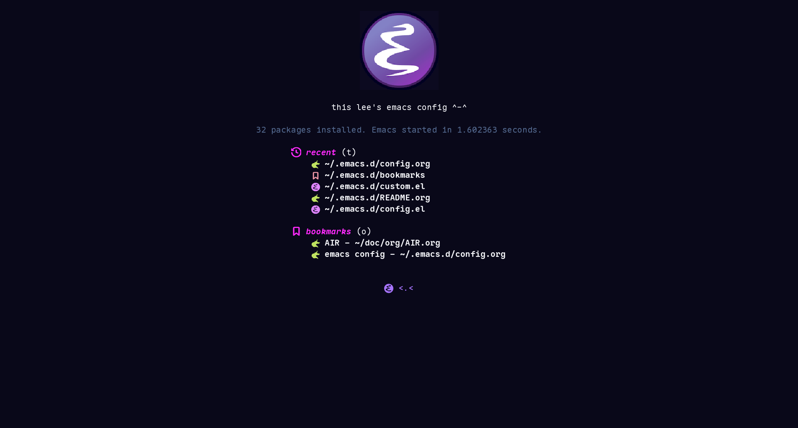
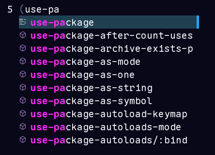
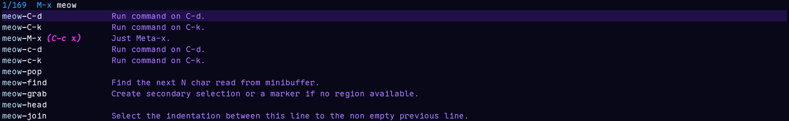

#+title: emacs.conf

=keyboard layout, branch d01: alternative=
#+caption: meow cheatsheet

this is basically lee's emacs config .,.

[[file:./config.org][config.org]] is the main config file

[[file:./init.el][init.el]] is responsible for converting ~config.org~ to its elisp equivalent [[file:./config.el][config.el]]

[[file:./custom.el][custom.el]] is for storing all custom sets

* showcase
** config
#+caption: org config

#+caption: elisp config

** dashboard
#+caption: dashboard

** compl
#+caption: company compl

#+caption: M-x menu compl

